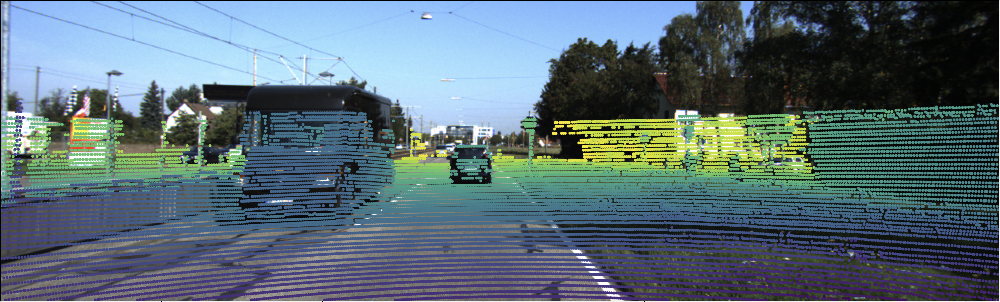
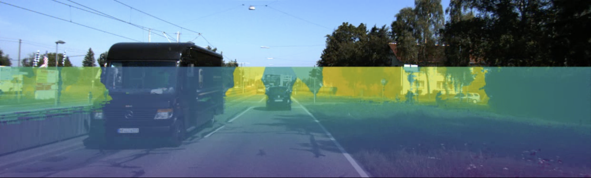
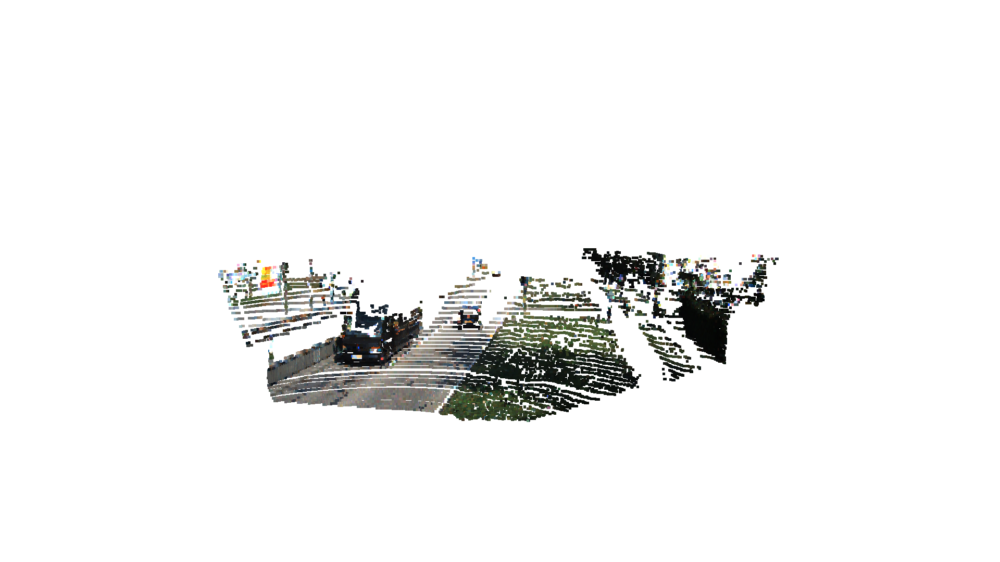

# KITTI LiDAR Camera Sensor Fusion

LiDAR and camera sensor fusion visualizer built in Python using the KITTI dataset.



---

## Overview

Sensor fusion is critical in autonomous vehicles as agents require data from multiple sources to operate reliably. LiDAR provides precise 3D spatial mapping while the camera provides rich visual context of the environment. Fusing these two modalities into a cohesive format enables better environmental understanding and decision making.

This project ingests raw KITTI LiDAR scans and camera images, applies calibration-based projection transforms to overlay depth-colored LiDAR points onto the image plane, generates dense depth maps via interpolation, and renders a full RGB-colored 3D point cloud — producing both still visualizations and an animated reconstruction of the full driving sequence.

---

## Mathematical Foundation

### Projection Pipeline

The full projection from LiDAR coordinates to image pixel coordinates is:

$$p_{image} = K \cdot [R \mid t] \cdot p_{lidar}$$

where $p_{lidar}$ is the 3D LiDAR point represented as a homogeneous vector $[x, y, z, 1]^T$.

### Step 1 — LiDAR to Camera Frame

The extrinsic matrix $[R \mid t]$ transforms points from the LiDAR coordinate frame into the camera coordinate frame, where $R$ is a $3 \times 3$ rotation matrix and $t$ is a $3 \times 1$ translation vector. Combined, this forms a $3 \times 4$ matrix. KITTI provides this via pykitti as `T_cam2_velo`.

$$p_{cam} = [R \mid t] \cdot p_{lidar}$$

### Step 2 — Camera Frame to Image Plane

The camera intrinsic matrix $K$ projects the 3D camera-frame point onto the 2D image plane. In practice, `P_rect_20` is used — a rectified $3 \times 4$ projection matrix provided by pykitti that incorporates $K$ and accounts for stereo camera alignment:

$$p_{image} = P_{rect} \cdot p_{cam}$$

The result is a homogeneous 2D vector $[x, y, w]^T$.

### Step 3 — Perspective Divide

To recover the final pixel coordinates, we divide by the scalar $w$:

$$u = \frac{x}{w}, \quad v = \frac{y}{w}$$

This encodes the perspective effect — objects further from the camera appear smaller in the image. Points with $w \leq 0$ are behind the camera and are discarded.

---

## Implementation Details

Each LiDAR scan is loaded and the intensity column is replaced with $1$ to form homogeneous coordinates. The full projection pipeline is applied in vectorized form using NumPy matrix operations across all points simultaneously.

Points are filtered in two stages: first, any point with a negative $w$ value after the extrinsic transform is discarded as it lies behind the camera. Second, projected pixel coordinates are checked against the image bounds ($0 \leq u \leq 1241$, $0 \leq v \leq 374$). Approximately 15% of the full 360° LiDAR scan survives both filters, consistent with the forward-facing camera's field of view.

Depth is encoded as the log-normalized $w$ value prior to the perspective divide, producing a perceptually uniform color gradient across near and far objects. RGB coloring of the 3D point cloud is achieved by indexing into the camera image array at each projected pixel coordinate.

Dense depth completion is available as an optional mode using `scipy.griddata` nearest-neighbor interpolation across the full image plane.

---

## Results

Results were generated using KITTI sequence `2011_09_26_drive_0015` — 297 frames of urban driving.

### Depth-Colored Interpolated LiDAR Projection



*LiDAR points projected onto the camera image, colored and interpolated by log-normalized depth using the viridis colormap.*

### RGB-Colored 3D Point Cloud



*Each LiDAR point colored with the RGB value of its corresponding camera pixel, visualized in Open3D.*

### Full Drive Sequence


*297-frame animated reconstruction of the full drive at 10fps.*

---

## Installation

Python 3.11 required.

```bash
pip install pykitti open3d scipy opencv-python matplotlib numpy
```

### Dataset Setup

Download the KITTI raw dataset from https://www.cvlibs.net/datasets/kitti/raw_data.php.
Download the synced+rectified data and calibration files for sequence `2011_09_26_drive_0015`.

Organize the data as follows:

```
data/
└── kitti/
    └── 2011_09_26/
        ├── calib_cam_to_cam.txt
        ├── calib_imu_to_velo.txt
        ├── calib_velo_to_cam.txt
        └── 2011_09_26_drive_0015_sync/
            ├── velodyne_points/
            └── oxts/
```

---

## Usage

```bash
python main.py
```

The program prompts for visualization mode:

| Input | Mode |
| --- | --- |
| `1` | Sparse depth-colored LiDAR overlay video |
| `2` | Dense depth-interpolated LiDAR overlay video |

---

## Future Work

- **Sparse coverage at distance** — LiDAR point density drops significantly at range, making it difficult to resolve objects such as cyclists. A learning-based depth completion method would improve density at distance.
- **3D RGB fusion** — the current fusion is projected onto the 2D image plane. Extending this to color the full 3D point cloud per frame and accumulate across the sequence would produce a richer reconstruction.
- **Object detection** — combining both modalities as input to a detection model is the logical extension toward a full perception pipeline.

---

## Related Projects

This project is the second in a series building toward a full AV perception pipeline on the KITTI dataset:

1. [Occupancy Grid Mapping](https://github.com/gsactown30/OccupancyGridMapping) — Bayesian probabilistic mapping with log-odds updates and Bresenham ray casting
2. [LiDAR Camera Sensor Fusion](https://github.com/gsactown30/KITTI-lidar-camera-sensor-fusion) — Full projection pipeline, dense depth completion, RGB-colored 3D point clouds
3. [KITTI 2D Object Detection and 3D Localization](https://github.com/gsactown30/KITTI-2D-object-detection-and-3D-localization) — YOLO11 detection, LiDAR depth sampling, back-projection into 3D camera coordinates

---

## References

- Geiger, A., Lenz, P., Stiller, C., Urtasun, R. (2013). Vision meets Robotics: The KITTI Dataset. *International Journal of Robotics Research*.
- KITTI Raw Data. https://www.cvlibs.net/datasets/kitti/raw_data.php
- NumPy Documentation. https://numpy.org/doc/
- SciPy Documentation. https://docs.scipy.org/